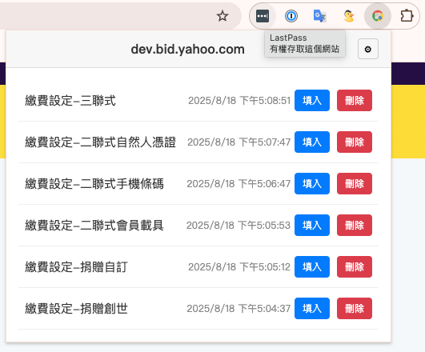

# 表單輸入儲存器 - Chrome 擴充功能

這是一個 Chrome 擴充功能，旨在解決重複填寫表單的煩惱。它可以安全地儲存您在網頁上輸入的表單資料，並在需要時一鍵快速填入。

## ✨ 功能亮點

- **多樣化儲存**：您可以在提交表單時儲存，也可以隨時透過右鍵選單手動儲存。
- **智慧化管理**：
    - **網站分類**：自動按網站將您的表單資料分門別類。
    - **自訂命名**：為每筆儲存的資料取個好記的名稱。
    - **快速存取**：點擊擴充功能圖示，會自動顯示當前網站的已存表單。
- **強大填入**：
    - **一鍵填入**：點擊「填入」即可完成。
    - **相容動態網頁**：能觸發網頁上的連動式選單等動態效果。
    - **智慧重試**：會等待動態產生的欄位出現，確保填入成功。
- **進階功能**：
    - **網站白名單 (v1.4 新增)**：擴充功能現在只會在您明確加入白名單的網站上注入內容腳本並提供表單儲存與填入功能。這取代了原有的黑名單功能，提供更精細的控制。
    - **資料備份**：可將所有資料匯出成 JSON 檔案，方便您備份或轉移到新電腦，並可隨時匯入。

## 🚀 如何使用

1.  **安裝擴充功能**：將擴充功能載入至您的 Chrome 瀏覽器。
2.  **啟用/停用網站功能**：
    - 點擊瀏覽器右上角的擴充功能圖示。
    - 在彈出視窗頂部，您會看到一個「啟用 formInputSaver」的開關。此開關會顯示當前網站是否已啟用擴充功能。
    - 若開關為「OFF」，點擊它會自動將當前網站加入白名單並啟用功能；若為「ON」，點擊它則會將當前網站從白名單移除並停用功能。
3.  **儲存表單**：
    - **自動儲存**：當您在白名單網站上提交表單時，擴充功能會詢問您是否要儲存。
    - **手動儲存**：在白名單網站的網頁上點擊右鍵，選擇「手動儲存表單內容」。
4.  **填入表單**：
    - 點擊瀏覽器右上角的擴充功能圖示。
    - 如果目前網站有已存資料，會直接顯示列表。如果沒有，您可以從網站總表中找到您需要的資料。
    - 點擊您想填入的資料旁的「填入」按鈕。
5.  **管理資料**：
    - 在彈出視窗中，您可以刪除單筆資料。
    - 點擊齒輪「⚙」圖示進入設定頁面，您可以進行資料的匯出與匯入。

## 📝 更新日誌

### v1.6 (最新)
- **手動儲存整頁輸入**：當頁面沒有 `<form>` 時，透過右鍵選單「手動儲存表單內容」會改為擷取整頁可輸入欄位，建立快照。
- **id-only 欄位支援**：即使欄位沒有 `name`、只有 `id`，也能被儲存並成功回填。
- **選擇器輔助回填**：儲存時會記錄可能的 selector，回填時若 `name/id` 匹配不到，會用 selector 再試一次，提高成功率。
- **Popup 介面調整**：設定按鈕僅在 snapshots 頁顯示；設定頁新增「已存資料的網站」列表（在白名單區塊下方）。
- **清空資料行為**：清空所有資料後，停留在 snapshots 並顯示空列表。
- **初始載入**：若無有效主機名（例如 Chrome 系統頁），改為顯示設定頁。

### v1.5
- **優化 Popup 初始頁面與白名單管理**：
    - Popup 預設顯示當前網站的表單快照列表，並在頂部提供一個開關，用於快速啟用/停用當前網站的擴充功能（加入/移除白名單）。
    - 設定頁面移除了手動新增白名單的輸入框，白名單網站的管理現在統一透過主頁的開關進行。
    - 調整了設定頁面中白名單移除按鈕的樣式，使其更美觀。
    - 修正了白名單網址列表的顯示問題，確保其有下邊線。
- **模態框互動優化**：點擊模態框外部區域可關閉模態框，提升使用者體驗。
- **匯出功能改進**：匯出檔案名稱現在包含時分秒，方便檔案管理。
- **程式碼清理**：移除了偵錯用的 `console.log` 語句。
- **UI 細節調整**：設定按鈕現在使用圖片作為背景，並調整了其大小。

### v1.4
- **將黑名單功能改為白名單**：擴充功能現在只會在使用者明確加入白名單的網站上注入內容腳本。這提供了更精細的控制，並解決了可能與其他網站腳本衝突的問題。

### v1.3
- **新增資料匯出／匯入功能**：可在設定頁面中，將所有已存資料（包含表單內容與網站黑名單）匯出成 JSON 檔進行備份，或從備份檔匯入資料。匯入時會與現有資料進行合併，避免重複。

### v1.2
- 新增網站分類儲存與手動儲存功能。
- 升級 Popup 介面，並強化填入與資料抓取機制。

### v1.1
- 新增自訂儲存對話框與網站黑名單功能。
- 修復中文亂碼與 JavaScript 事件觸發問題。
